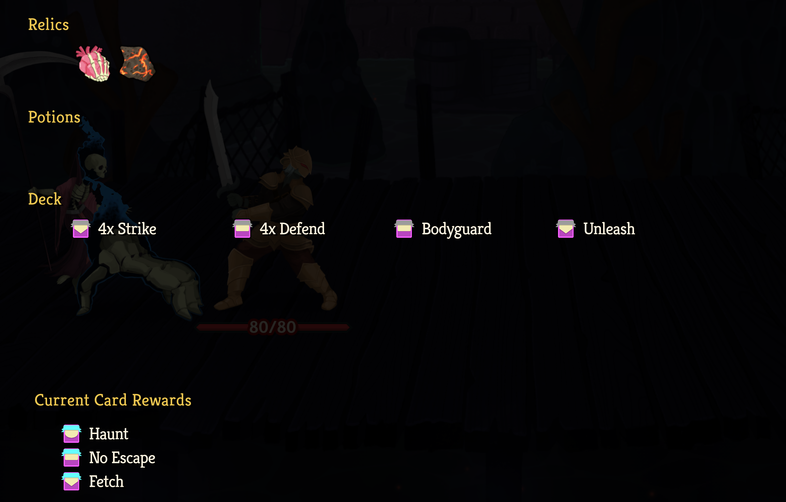
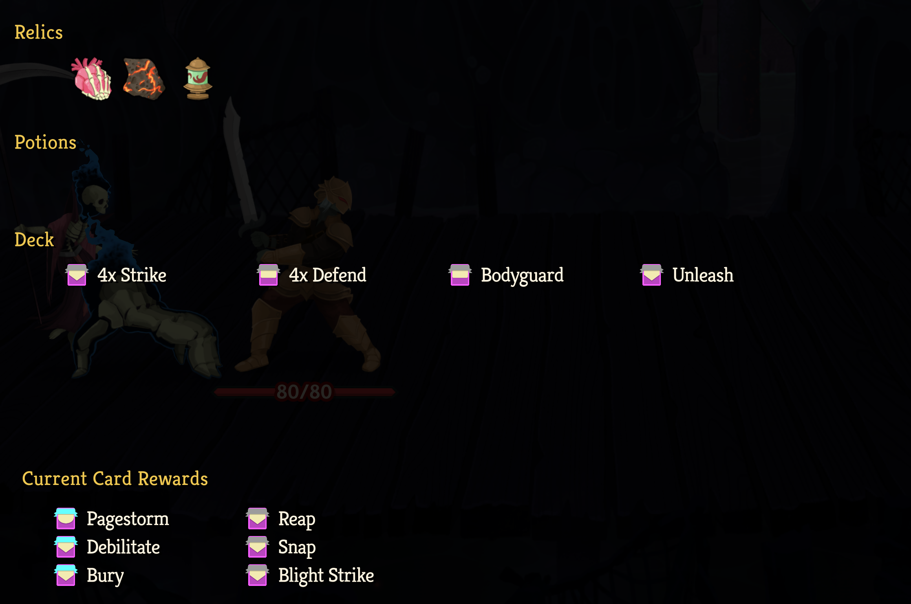

## View Multiplayer Cards Rewards

A mod for Slay the Spire 2 that allows you to see the card rewards of other players in
their multiplayer status menu.

Works with standard card rewards from combats as well as others (e.g. mind leech, colourful philosophers, orrery)

If they have multiple card rewards, displays the different rewards in different columns.

All players should have the mod for it to work correctly, but it does not affect gameplay, so is MP-safe if not all players have it installed.
